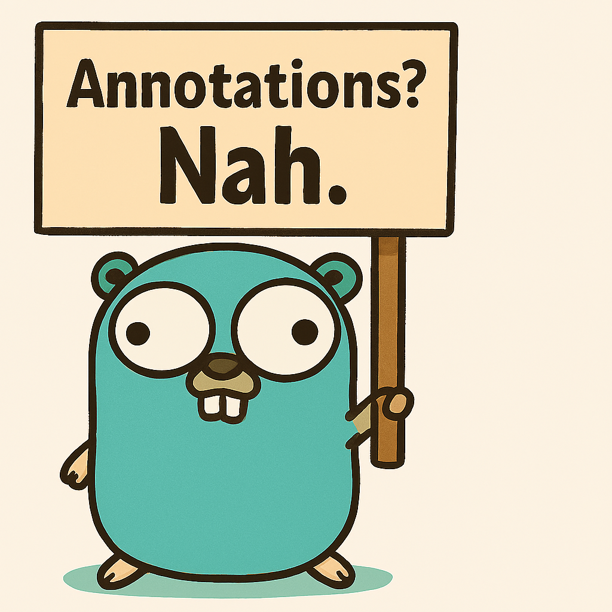
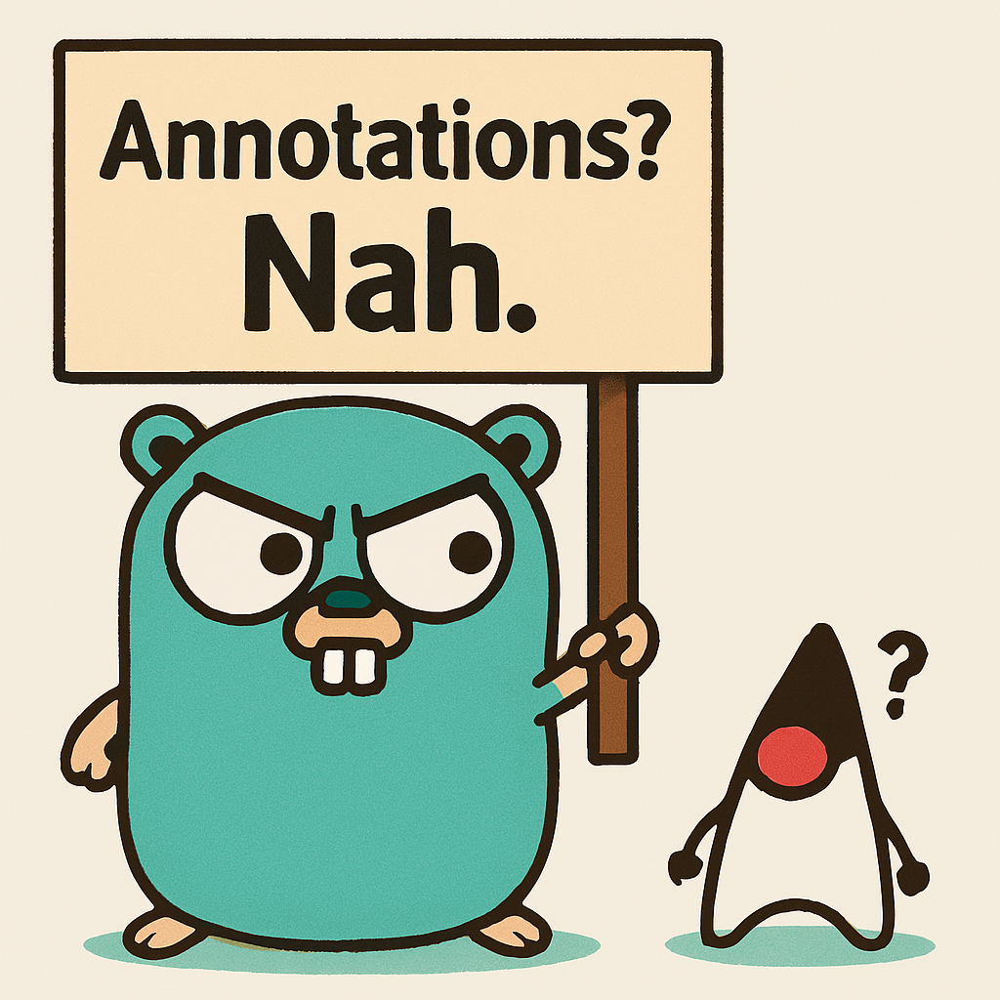

# gosaidsno

> _I really wanted to use annotations…_  
> _but Go said no._

<p align="center">
  
  
</p>

**AOP without annotations. Just function wrapping. The Go way.**

### 🤡 What This Solves (The Go Way)

> You’re tired of writing this everywhere:  
> ```go  
> func ProcessPayment() error {  
>     log.Println("starting...")  
>     err := callStripe()  
>     log.Println("done.")  
>     return err  
> }  
> ```  
>  
> And you *really* wanted to write:  
> ```java  
> @Around("callStripe()")  
> public void logAndRetry() { ... }  
> ```  
>  
> **But Go said no.**  
>  
> So `gosaidsno` lets you:  
>  
> ✅ **Stop copy-pasting logging/retry/auth code**  
> ✅ **Stop pretending Go has annotations**  
> ✅ **Start wrapping functions like a sane adult**  
>  
> No magic. No reflection. No `@Aspect`.  
> Just **register a func. Add some advice. Let it rip.**  
>  
> *You didn’t ask for AOP.*  
> *You just wanted your code to not suck.*  
>  
> **This is your non-magic, slightly sarcastic fix.**
